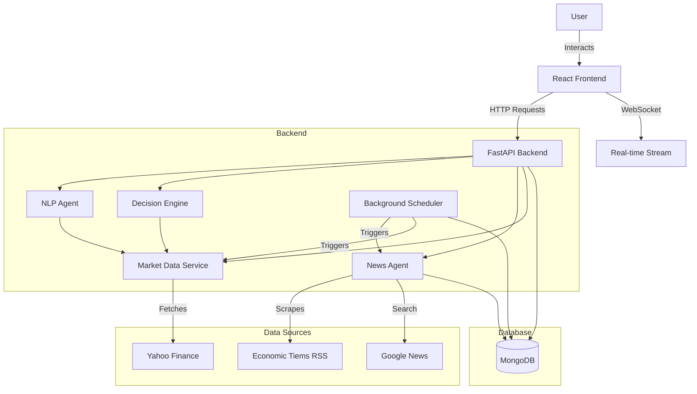
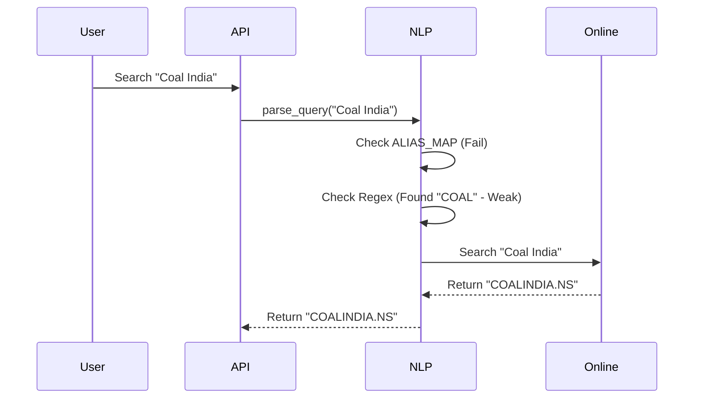
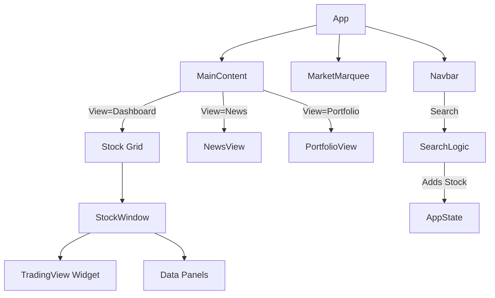

# CIO Trading System - Full Documentation

## 1. System Overview

The **CIO (Chief Investment Officer)** application is an intelligent, AI-powered stock trading assistant. It combines a high-performance **FastAPI backend** with a responsive **React frontend** to provide real-time market data, technical analysis, and automated insights.

### High-Level Architecture

---

## 2. Core Agents & Services (Backend)

The backend is composed of specialized "Agents" or Services, each responsible for a specific domain of logic.

### 2.1. NLP Service (The "Search Agent")
*   **Role**: Understands user queries and resolves them to actionable stock tickers.
*   **Key Logic**:
    1.  **Intent Detection**: Identifies if the user wants to "BUY", "SELL", or just "VIEW".
    2.  **Alias Resolution**: Maps common names (e.g., "ICICI", "Reliance") to official NSE tickers (`ICICIBANK.NS`, `RELIANCE.NS`) using a specialized `ALIAS_MAP`.
    3.  **Smart Fallback**: If a local match isn't found, it initiates an **Online Search** (via Yahoo Finance Autocomplete) to find the correct symbol dynamically.
    4.  **Correction**: Automatically appends `.NS` or `.BO` suffixes for Indian markets.

### 2.2. Decision Engine (The "Analyst Agent")
*   **Role**: Analyzes stock data to generate Buy/Sell signals and confidence scores.
*   **Key Logic**:
    *   **Technical Analysis**: Computes RSI, MACD, Bollinger Bands, Moving Averages (EMA/SMA), and ADX.
    *   **Fundamental Analysis**: Evaluates P/E Ratio, Market Cap, Profit Margins, and Debt/Equity.
    *   **Signal Generation**:
        *   **BUY**: If RSI < 30 (Oversold) AND MACD Crossover AND Price > EMA 200.
        *   **SELL**: If RSI > 70 (Overbought) OR Price < Stop Loss levels.
    *   **Scoring**: assigns a `confidence` score (0-100%) based on how many indicators align with the signal.

### 2.3. News Service (The "Info Agent")
*   **Role**: Aggregates and serves financial news.
*   **Key Logic**:
    *   **Background Sync**: A scheduled task runs every 60 seconds to fetch RSS feeds (e.g., Economic Times).
    *   **Deduplication**: Checks MongoDB to ensure the same article isn't stored twice.
    *   **Caching**: Serves news from the database for instant load times, avoiding external API latency on client requests.

### 2.4. Scheduler Service (The "Watchdog")
*   **Role**: Manages background tasks.
*   **Key Logic**:
    *   **Stock Monitoring**: When a user opens a stock window, a job creates a specific monitor task for that ticker.
    *   **Alerts**: Constantly checks live prices against user-set alert thresholds (e.g., "Notify if HDFC > 1700").

---

## 3. UI Architecture (Frontend)

The frontend is built with **React + Vite** and **Tailwind CSS**, focusing on a "Glassmorphism" dark-mode aesthetic.

### 3.1. Main Layout
*   **`App.jsx`**: The root orchestrator.
    *   **State**: Manages the list of active `stocks` (windows on dashboard).
    *   **Routing**: Uses a simple "view" state (`activeView`) to switch between Dashboard, Portfolio, News, etc.
    *   **Global Navbar**: Contains the Search Bar and Sidebar toggle.

### 3.2. Service Integration (`api.js`)
*   Centralized API layer that communicates with the backend.
*   Handles `GET`, `POST` requests and error parsing.

### 3.3. Key Components

#### **StockWindow (`StockWindow.jsx`)**
The flagship component of the application.
*   **Features**:
    *   **Maximize/Minimize**: Toggles between a grid card and a full-screen immersive view.
    *   **Resizable**: Supports vertical resizing via CSS `resize-y`.
    *   **Live Charts**: Integrates **TradingView Widget** for professional-grade charting.
    *   **Tabs**: Overview, Technicals, Fundamentals, Risk, News.
*   **UI Logic**:
    *   Connects to a **WebSocket** for real-time price updates (flashing green/red indicators).
    *   Fetches initial deep analysis from `get_stock_analysis`.

#### **HomeView (`HomeView.jsx`)**
The landing page.
*   **Features**:
    *   **Market Summary**: Displays NIFTY 50 and SENSEX status.
    *   **Trending Stocks**: Lists top gainers/losers dynamically.
    *   **Latest NewsGrid**: A masonry-style grid of the latest market news with images.

#### **TechnicalView (`TechnicalView.jsx`)**
A dedicated dashboard for pure technical data.
*   Displays a comprehensive table of all tracked stocks with their RSI, MACD, and Signal status.

### 3.4. Component Interaction Diagram

---

## 4. UI/UX Design Philosophy

*   **Theme**: Deep "Slate" Dark Mode (`bg-slate-950`) with "Cyan" accents (`text-cyan-400`).
*   **Glassmorphism**: Semi-transparent backgrounds (`bg-slate-900/50`) with borders (`border-slate-800`).
*   **Typography**: Monospace fonts (`font-mono`) for data/numbers to emphasize financial precision.
*   **Responsiveness**: Fully responsive Grid layouts (CSS Grid) that adapt from Mobile (1 col) to Desktop (3 cols).

## 5. Visual Guide

### Stock Window (Maximized)
*   **Header**: Ticker Name, Live Status, Maximize/Close Controls.
*   **Body**: Large centralized Chart (TradingView).
*   **Footer/Tabs**: Detailed tables for Fundamentals and Technical Indicators.

### Dashboard
*   **Dynamic Grid**: Windows flow naturally.
*   **Market Marquee**: A scrolling ticker tape at the top showing global indices.

---
*Created by CIO AI Team | Version 1.2.0*
